<div align="center">

# 🤖 IPI Smart Academic System - NLP Service

### *AI-Powered Chatbot with Mistral LLM & Knowledge Base RAG*

[](https://www.python.org/)
[](https://flask.palletsprojects.com/)
[](https://mistral.ai/)

**[🚀 Live Service](https://amartubic.pythonanywhere.com)** • **[📚 Main Docs](../README.md)** • **[💬 Test Chatbot](https://ipi-smart-academic-system.vercel.app)**

</div>

---

## 📋 Table of Contents

- [🎯 Overview](#-overview)
- [✨ Features](#-features)
- [🧠 How It Works](#-how-it-works)
- [🛠️ Tech Stack](#️-tech-stack)
- [🚀 Getting Started](#-getting-started)
- [📁 Project Structure](#-project-structure)
- [🌐 API Endpoints](#-api-endpoints)
- [📚 Knowledge Base](#-knowledge-base)
- [🔧 Configuration](#-configuration)
- [🚢 Deployment](#-deployment)

---

## 🎯 Overview

The **NLP Service** is a Flask-based microservice that powers the **AI chatbot** for instant academic assistance. It leverages **Mistral AI** Large Language Model via GitHub Models API to provide intelligent, context-aware responses to student queries about enrollment, exams, faculty information, and academic procedures.

### **🌟 Purpose & Goals**

- **🤖 24/7 AI Support** - Answer student questions instantly without human intervention
- **🧠 Smart Responses** - Context-aware answers using Retrieval-Augmented Generation (RAG)
- **📚 Knowledge Grounded** - Responses based on actual faculty documentation, not hallucinations
- **⚡ Fast Performance** - Sub-2-second response time for typical queries
- **🌐 API-First** - RESTful endpoint for frontend integration
- **🔒 Safe & Reliable** - Filtered content, error handling, fallback responses

### **💡 Use Cases**

Students can ask questions like:
- "Kako se prijaviti za ispit iz matematike?" *(How to register for math exam?)*
- "Koliko ECTS kredita trebam za drugu godinu?" *(How many ECTS credits for second year?)*
- "Koji su preduvjeti za Algoritme?" *(What are prerequisites for Algorithms?)*
- "Gdje mogu pronaći raspored predavanja?" *(Where can I find lecture schedule?)*

---

## ✨ Features

### **🧠 AI-Powered Intelligence**

<table>
<tr>
<td width="50%">

**🔍 Hybrid Search**
- Keyword extraction from queries
- Context retrieval from knowledge base
- Semantic matching
- Relevance scoring
- Top-N context selection

</td>
<td width="50%">

**💬 Natural Language Understanding**
- Handles Croatian language
- Typo tolerance
- Multiple question formats
- Conversational context
- Intent recognition

</td>
</tr>
</table>

### **📚 Knowledge Base System**

- **Faculty Information** - Programs, majors, courses
- **Enrollment Rules** - ECTS limits, prerequisites, year progression
- **Exam Procedures** - Registration steps, deadlines, policies
- **Administrative Info** - Contact details, office hours
- **Custom Content** - Easily updateable text files

### **🚀 Performance Features**

- ✅ **Fast Responses** - Average 1.5s latency
- ✅ **CORS Enabled** - Frontend integration ready
- ✅ **Error Recovery** - Graceful fallbacks
- ✅ **Logging** - Request/response tracking
- ✅ **Scalable** - Stateless design

### **🤖 Mistral AI Integration**

```python
# Powered by Mistral-Large via GitHub Models
model = "Mistral-large"
temperature = 0.7  # Balance between creativity & accuracy
max_tokens = 500   # Concise responses
```

**Why Mistral AI?**
- 🚀 High-quality, fast inference
- 💰 Cost-effective via GitHub Models
- 🌍 Good multilingual support (Croatian)
- 🔒 Privacy-focused (no data retention)

---

## 🧠 How It Works

### **Request Flow Diagram**

```mermaid
sequenceDiagram
    participant User as 👤 User (Frontend)
    participant Flask as 🔧 Flask API
    participant KB as 📚 Knowledge Base
    participant Mistral as 🤖 Mistral AI
    
    User->>Flask: POST /search {"word": "Kako se upisati?"}
    Flask->>Flask: Extract keywords ("upisati")
    Flask->>KB: Search for matching context
    KB-->>Flask: Return relevant text chunks
    Flask->>Mistral: Prompt with context + question
    Mistral-->>Flask: Generate AI response
    Flask->>Flask: Format & validate response
    Flask-->>User: JSON {"response": "...", "context_used": [...]}
```



### **Step-by-Step Process**

#### **1. Keyword Extraction**

```python
# User query: "Kako se prijaviti za ispit iz matematike?"
keywords = extract_keywords(query)
# Result: ["prijaviti", "ispit", "matematike"]
```

#### **2. Context Retrieval**

```python
# Search knowledge base for relevant content
context_chunks = []
for keyword in keywords:
    matches = search_knowledge_base(keyword)
    context_chunks.extend(matches)

# Result: Text about exam registration procedures
```

#### **3. AI Response Generation**

```python
# Build prompt for Mistral AI
prompt = f"""
You are an academic assistant for the faculty.
Based on this context:
{context_chunks}

Answer this student question:
{user_question}

Provide a clear, concise answer in Croatian.
"""

# Send to Mistral AI
response = mistral_client.chat.completions.create(
    model="Mistral-large",
    messages=[{"role": "user", "content": prompt}],
    temperature=0.7,
    max_tokens=500
)
```

#### **4. Response Formatting**

```python
# Return structured JSON
return {
    "response": ai_generated_text,
    "context_used": [chunk1, chunk2],
    "query": original_question
}
```

---

## 🛠️ Tech Stack

### **Core Technologies**

| Technology | Version | Purpose | Why Chosen |
|------------|---------|---------|------------|
|  **Python** | 3.10+ | Language | ML/AI ecosystem, async support |
|  **Flask** | 3.1.0 | Web Framework | Lightweight, easy to deploy |
| **Mistral AI** | Latest | LLM | High-quality multilingual responses |
| **GitHub Models** | API | Model Hosting | Free tier, good performance |

### **Python Libraries**

| Library | Purpose |
|---------|---------|
| **requests** | HTTP client for API calls |
| **flask-cors** | CORS middleware |
| **python-dotenv** | Environment variable management |
| **openai** | SDK for GitHub Models API (OpenAI-compatible) |

---

## 🚀 Getting Started

### **Prerequisites**

- **Python** 3.10 or higher
- **pip** package manager
- **Git** for version control
- **GitHub account** (for API token)

### **Installation**

```bash
# Navigate to NLP directory
cd NLP

# Create virtual environment (recommended)
python -m venv venv

# Activate virtual environment
# Windows:
venv\Scripts\activate
# Linux/Mac:
source venv/bin/activate

# Install dependencies
pip install -r requirements.txt

# This installs:
# - Flask 3.1.0
# - flask-cors
# - requests
# - openai (for Mistral API)
# - python-dotenv
```

### **Environment Configuration**

Create `.env` file in `NLP/` directory:

```env
# Mistral AI via GitHub Models (REQUIRED)
GITHUB_TOKEN=ghp_your_github_personal_access_token_here

# Alternative: Direct Mistral API (optional)
OPEN_API_KEY_MISTRAL=your_mistral_api_key_if_you_have_one

# Optional: OpenAI for embeddings (future RAG enhancement)
OPEN_API_KEY_OPENAI=sk-your_openai_key

# Flask Configuration
FLASK_ENV=development
FLASK_DEBUG=True
FLASK_APP=main.py

# Server Settings
HOST=0.0.0.0
PORT=5000
```

### **Getting GitHub Token**

1. Go to [GitHub Settings → Tokens](https://github.com/settings/tokens)
2. Click **"Generate new token (classic)"**
3. Give it a name: "IPI Academic Chatbot"
4. Select scopes: **`read:packages`**
5. Generate token
6. Copy token to `.env` file

### **Running the Service**

```bash
# Start Flask development server
python main.py

# Output:
# 🤖 NLP Service starting...
# 📚 Loading knowledge base...
# ✅ Knowledge base loaded: 1500 characters
# 🌐 Server running on http://localhost:5000
# 💬 Ready to answer questions!
```

**What happens:**
1. Flask app initializes on port **5000**
2. Knowledge base (`fakultetski_sadržaj.txt`) loaded into memory
3. CORS enabled for frontend (default: `http://localhost:5173`)
4. API endpoint `/search` available

### **Testing the API**

```bash
# Using curl
curl -X POST http://localhost:5000/search \
  -H "Content-Type: application/json" \
  -d '{"word":"Kako se upisati na fakultet?"}'

# Using Python requests
import requests
response = requests.post('http://localhost:5000/search', json={
    'word': 'Koliko ECTS kredita trebam?'
})
print(response.json()['response'])
```

**Expected Response:**

```json
{
  "response": "Za upis u drugu godinu studija potrebno je ostvariti najmanje 37 ECTS kredita iz prve godine. Maksimalan broj ECTS kredita koji možete upisati u jednoj godini je 60.",
  "context_used": [
    "Upis u višu godinu: Student može upisati drugu godinu ako je ostvario najmanje 37 ECTS bodova...",
    "ECTS krediti: Svaki predmet nosi određen broj ECTS kredita. Maksimum je 60 ECTS po godini..."
  ],
  "query": "Koliko ECTS kredita trebam?"
}
```

---

## 📁 Project Structure

```
NLP/
│
├── 📂 app/                       # Flask application package
│   ├── __init__.py              # Flask app factory
│   ├── routes.py                # API endpoint definitions
│   ├── services.py              # Business logic (search, AI)
│   └── nlp_utils.py             # NLP utility functions
│
├── 📂 document_service/          # Document processing (future)
│   ├── extract_file.py          # PDF/DOCX extraction
│   ├── normalize_text.py        # Text preprocessing
│   └── similarity_checker.py    # Semantic similarity
│
├── 📂 notification_service/      # Email notifications (future)
│   ├── emailTemplate.py         # Email templates
│   ├── initClient.py            # SMTP client setup
│   └── main.py                  # Notification logic
│
├── 📂 s3_bucket/                 # Cloud storage integration (future)
│   ├── client.py                # S3 client
│   └── main.py                  # Upload/download handlers
│
├── 📄 main.py                    # Flask entry point (runs server)
├── 📄 fakultetski_sadržaj.txt   # Knowledge base (Croatian text)
├── 📄 requirements.txt           # Python dependencies
├── 📄 runtime.txt                # Python version for deployment
├── 📄 .env                       # Environment variables (not in Git)
│
├── 📄 flask_app_mistral_direct.py   # Alternative: Direct Mistral API
├── 📄 flask_app_unified.py          # Alternative: Unified endpoint
├── 📄 simple_chatbot.py             # Simple keyword-based bot
├── 📄 vector_rag_system.py          # RAG with vector embeddings (WIP)
│
└── 📄 README.md                  # This file
```

---

## 🌐 API Endpoints

### **POST /search**

Search for answer to student question using AI.

**Request:**

```http
POST http://localhost:5000/search
Content-Type: application/json

{
  "word": "Kako se prijaviti za ispit?"
}
```

**Response:**

```json
{
  "response": "Da biste se prijavili za ispit, pratite ove korake:\n1. Prijavite se na studentski portal\n2. Idite na stranicu 'Ispiti'\n3. Odaberite predmet\n4. Kliknite na dugme 'Prijavi se'\n5. Potvrdite prijavu\n\nPrijave su obično otvorene 7 dana prije ispita.",
  "context_used": [
    "Prijava za ispit: Student se prijavljuje putem online portala...",
    "Rok za prijavu: Prijave se zatvaraju 3 dana prije termina ispita..."
  ],
  "query": "Kako se prijaviti za ispit?"
}
```

**Parameters:**

| Field | Type | Required | Description |
|-------|------|----------|-------------|
| `word` | string | ✅ Yes | Student's question in Croatian |

**Response Fields:**

| Field | Type | Description |
|-------|------|-------------|
| `response` | string | AI-generated answer |
| `context_used` | array | Knowledge base chunks used for context |
| `query` | string | Original question (normalized) |

**Error Responses:**

```json
// Missing 'word' parameter
{
  "error": "Missing 'word' parameter"
}

// AI API failure
{
  "error": "Failed to generate response",
  "details": "API timeout"
}
```

### **GET /**

Health check endpoint.

**Response:**

```json
{
  "status": "ok",
  "service": "NLP Chatbot",
  "version": "1.0.0"
}
```

---

## 📚 Knowledge Base

### **Content Structure**

The knowledge base (`fakultetski_sadržaj.txt`) contains:

```
📖 Fakultetski Sadržaj

Upis Studenata
--------------
Student se upisuje na fakultet putem online prijave...

ECTS Krediti
------------
ECTS (European Credit Transfer System) je sistem bodovanja...
Svaki predmet nosi određen broj ECTS kredita (obično 3-9).
Za upis u višu godinu potrebno je ostvariti minimum 37 ECTS.

Prijava za Ispit
----------------
Student se prijavljuje za ispit putem studentskog portala...
Rok za prijavu je 7 dana prije ispita.
...
```

### **Updating Knowledge Base**

1. Open `fakultetski_sadržaj.txt`
2. Add/modify content in plain Croatian text
3. Use clear section headers
4. Save file
5. Restart Flask server

**Best Practices:**
- ✅ Use clear, simple language
- ✅ Structure with headings
- ✅ Include specific numbers (ECTS, deadlines)
- ✅ Cover common questions
- ❌ Avoid redundancy
- ❌ Don't include outdated info

### **Adding PDF Knowledge (Future Enhancement)**

```python
# document_service/extract_file.py
from PyPDF2 import PdfReader

def extract_pdf_text(pdf_path):
    reader = PdfReader(pdf_path)
    text = ""
    for page in reader.pages:
        text += page.extract_text()
    return text

# Add to knowledge base
new_content = extract_pdf_text("student_handbook.pdf")
```

---

## 🔧 Configuration

### **Mistral AI Settings**

Edit `app/services.py`:

```python
# Model selection
MODEL = "Mistral-large"  # Options: Mistral-large, Mistral-small

# Generation parameters
TEMPERATURE = 0.7  # 0.0 = deterministic, 1.0 = creative
MAX_TOKENS = 500   # Response length limit
TOP_P = 1.0        # Nucleus sampling

# Prompt template
SYSTEM_PROMPT = """
You are a helpful academic assistant for a university faculty.
Answer student questions clearly and concisely in Croatian.
Base your answers on the provided context.
If you don't know, say so - don't make up information.
"""
```

### **CORS Configuration**

Edit `main.py`:

```python
from flask_cors import CORS

# Allow specific origins
CORS(app, origins=[
    "http://localhost:5173",  # Frontend dev
    "https://ipi-smart-academic-system.vercel.app"  # Production
])

# Or allow all (development only)
CORS(app, origins="*")
```

### **Context Retrieval Tuning**

Edit `app/services.py`:

```python
# Number of context chunks to retrieve
MAX_CONTEXT_CHUNKS = 3

# Minimum keyword match length
MIN_KEYWORD_LENGTH = 3

# Context window size (characters)
CONTEXT_WINDOW = 200
```

---

## 🚢 Deployment

### **Deploying to PythonAnywhere**

**Step-by-step guide:**

1. **Create Account**
   - Go to [PythonAnywhere.com](https://www.pythonanywhere.com)
   - Sign up for free account

2. **Upload Code**
   ```bash
   # Option 1: Git clone
   git clone https://github.com/EvillDeadSpace/IPI-Smart-Academic-System.git
   cd IPI-Smart-Academic-System/NLP
   
   # Option 2: Upload ZIP via web interface
   ```

3. **Setup Virtual Environment**
   ```bash
   python3.10 -m venv venv
   source venv/bin/activate
   pip install -r requirements.txt
   ```

4. **Configure WSGI**
   
   Create `/var/www/yourusername_pythonanywhere_com_wsgi.py`:
   
   ```python
   import sys
   import os
   
   # Add project directory
   path = '/home/yourusername/IPI-Smart-Academic-System/NLP'
   if path not in sys.path:
       sys.path.append(path)
   
   # Load environment variables
   from dotenv import load_dotenv
   load_dotenv(os.path.join(path, '.env'))
   
   # Import Flask app
   from main import app as application
   ```

5. **Set Environment Variables**
   - Dashboard → Web → Environment Variables
   - Add `GITHUB_TOKEN`

6. **Reload Web App**
   - Click "Reload" button
   - Service available at: `https://yourusername.pythonanywhere.com`

---

### **Alternative: Deploying to Railway**

```bash
# Install Railway CLI
npm i -g @railway/cli

# Login
railway login

# Initialize project
railway init

# Deploy
railway up

# Set environment variables
railway variables set GITHUB_TOKEN=ghp_...
```

---

### **Alternative: Deploying to Render**

1. Create `render.yaml`:

```yaml
services:
  - type: web
    name: nlp-service
    runtime: python
    buildCommand: pip install -r requirements.txt
    startCommand: gunicorn main:app
    envVars:
      - key: GITHUB_TOKEN
        sync: false
```

2. Connect GitHub repo
3. Deploy automatically on push

---

## 🧪 Testing & Debugging

### **Testing Locally**

```python
# test_nlp_setup.py
import requests

def test_search():
    response = requests.post('http://localhost:5000/search', json={
        'word': 'Koliko ECTS kredita trebam za drugu godinu?'
    })
    
    assert response.status_code == 200
    data = response.json()
    assert 'response' in data
    assert '37' in data['response']  # Expected ECTS number
    print("✅ Test passed!")

if __name__ == '__main__':
    test_search()
```

### **Debugging Tips**

```python
# Add logging to services.py
import logging
logging.basicConfig(level=logging.DEBUG)

# In search function
logging.debug(f"Query: {user_query}")
logging.debug(f"Keywords: {keywords}")
logging.debug(f"Context chunks: {len(context_chunks)}")
logging.debug(f"AI response: {ai_response[:100]}...")
```

---

## 📚 Future Enhancements

### **Planned Features**

- [ ] **Vector RAG** - Semantic search with embeddings
- [ ] **Conversation Memory** - Multi-turn conversations
- [ ] **PDF Ingestion** - Automatic document processing
- [ ] **Multi-language** - Support for English queries
- [ ] **Analytics Dashboard** - Track popular questions
- [ ] **Feedback Loop** - User ratings for responses
- [ ] **Caching** - Redis for faster repeated queries

---

## 🤝 Contributing

We welcome improvements! Ideas:
- Add more knowledge base content
- Improve keyword extraction
- Implement vector embeddings
- Add unit tests
- Optimize prompts

---

<div align="center">

### 🤖 Powered by Mistral AI & Flask

**Built with ❤️ to make academic life easier**

[⬆ Back to Top](#-ipi-smart-academic-system---nlp-service)

</div>
