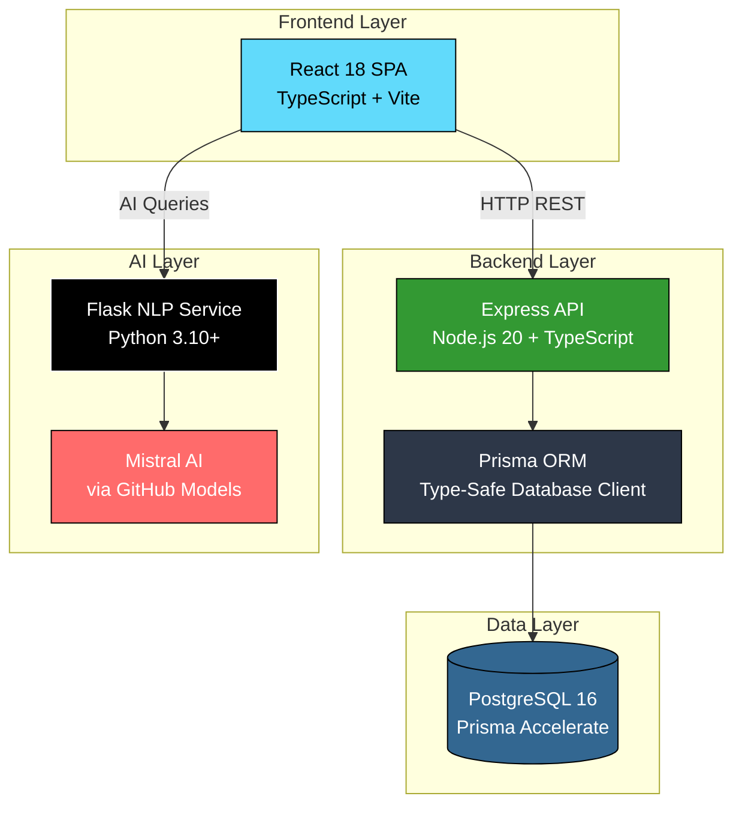

<div align="center">

# 🎓 IPI Smart Academic System

### *Next-Generation Academic Management Platform with AI-Powered Student Assistant*

[](https://opensource.org/licenses/MIT)
[](https://www.typescriptlang.org/)
[](https://reactjs.org/)
[](https://nodejs.org/)
[](https://www.prisma.io/)
[](https://flask.palletsprojects.com/)
[](https://www.postgresql.org/)

**[🚀 Live Demo](https://ipi-smart-academic-system.vercel.app)** • **[📚 Documentation](#-documentation)** • **[🤝 Contributing](CONTRIBUTING.md)** • **[📝 License](LICENSE)**

---

</div>

## 📋 Table of Contents

- [🎯 Overview](#-overview)
- [✨ Key Features](#-key-features)
- [🏗️ Architecture](#️-architecture)
- [🛠️ Technology Stack](#️-technology-stack)
- [🚀 Quick Start](#-quick-start)
- [📁 Project Structure](#-project-structure)
- [🌐 API Documentation](#-api-documentation)
- [🚢 Deployment](#-deployment)
- [🤝 Contributing](#-contributing)
- [📄 License](#-license)

---

## 🎯 Overview

**IPI Smart Academic System** is a cutting-edge, full-stack academic management platform engineered to modernize university operations and enhance student experience. Built with a **microservices architecture**, it seamlessly integrates traditional student information system capabilities with **AI-powered conversational assistance** through Mistral AI.

### 🌟 Project Goals

Our mission is to revolutionize academic administration by:

- **🚀 Streamlining Operations** - Automate enrollment, exam registration, and grade management
- **🤖 AI-First Approach** - 24/7 intelligent chatbot for instant student support
- **📊 Real-Time Insights** - Live academic progress tracking with ECTS-compliant calculations
- **🎨 Modern UX** - Intuitive, responsive design for mobile-first generation
- **🔒 Security & Compliance** - Role-based access control with secure authentication
- **⚡ Performance** - Serverless architecture for scalable, lightning-fast responses

### 🌐 Live Deployments

| Service | URL | Status |
|---------|-----|--------|
| **🎨 Frontend** | [ipi-smart-academic-system.vercel.app](https://ipi-smart-academic-system.vercel.app) |  |
| **🔧 Backend API** | [ipi-smart-academic-system-dzhc.vercel.app](https://ipi-smart-academic-system-dzhc.vercel.app) |  |
| **🤖 NLP Service** | [amartubic.pythonanywhere.com](https://amartubic.pythonanywhere.com) |  |

---

## ✨ Key Features

### 👨‍🎓 **Student Portal**

<table>
<tr>
<td width="50%">

#### 📊 Academic Progress Dashboard
- ✅ Real-time ECTS credit tracking
- ✅ GPA calculation (5.0-10.0 scale)
- ✅ Course completion percentage
- ✅ Semester-by-semester breakdown
- ✅ Visual progress charts

</td>
<td width="50%">

#### 📚 Smart Course Enrollment
- ✅ Prerequisite validation
- ✅ ECTS limit enforcement (60/year)
- ✅ Year progression rules
- ✅ Available courses filtering
- ✅ Instant enrollment confirmation

</td>
</tr>
<tr>
<td width="50%">

#### 📅 Exam Management
- ✅ Upcoming exams calendar
- ✅ One-click online registration
- ✅ Exam history & results
- ✅ Retry tracking
- ✅ Deadline notifications

</td>
<td width="50%">

#### 💬 AI Academic Assistant
- ✅ Natural language queries
- ✅ 24/7 instant responses
- ✅ Faculty info knowledge base
- ✅ Enrollment rules & procedures
- ✅ Powered by **Mistral AI**

</td>
</tr>
</table>

---

### 👨‍🏫 **Professor Dashboard**

<table>
<tr>
<td width="50%">

#### 📝 Exam Scheduling
- ✅ Create exam sessions
- ✅ Set date, time & location
- ✅ Exam type selection
- ✅ Student registration tracking
- ✅ Capacity management

</td>
<td width="50%">

#### ✅ Grading System
- ✅ Record student grades
- ✅ Automatic grade calculation
- ✅ ECTS credit assignment
- ✅ Pass/fail statistics
- ✅ Bulk grade import

</td>
</tr>
<tr>
<td width="50%">

#### 📊 Student Analytics
- ✅ Per-subject performance
- ✅ Attendance tracking
- ✅ Grade distribution charts
- ✅ Trend analysis
- ✅ Export to CSV/PDF

</td>
<td width="50%">

#### 📚 Course Management
- ✅ Subject assignment
- ✅ Syllabus management
- ✅ Resource uploads
- ✅ Announcement posting
- ✅ Student communication

</td>
</tr>
</table>

---

### 🔧 **Admin Control Panel**

<table>
<tr>
<td width="33%">

**👥 User Management**
- Register students
- Register professors
- Manage admin accounts
- Bulk user import
- Account activation

</td>
<td width="33%">

**🎓 Academic Setup**
- Create study programs
- Define majors
- Configure curricula
- Manage ECTS credits
- Set prerequisites

</td>
<td width="33%">

**📊 Analytics & Reports**
- Enrollment statistics
- Performance metrics
- Usage analytics
- Export reports
- Audit logs

</td>
</tr>
</table>

---

## 🏗️ Architecture

### **System Architecture Diagram**



### **🎯 Microservices Architecture**

This project follows a **clean separation of concerns** with three independent services:

| Service | Port | Technology | Responsibility |
|---------|------|-----------|----------------|
| **🎨 Frontend** | 5173 | React + Vite | User interface, routing, state management |
| **🔧 Backend API** | 3001 | Express + Prisma | Business logic, data validation, authentication |
| **🤖 NLP Service** | 5000 | Flask + Mistral | Natural language processing, chatbot responses |

### **🔄 Data Flow**

```
┌─────────────────────────────────────────────────────────────┐
│  1. User Interaction (React UI)                             │
└───────────────────┬─────────────────────────────────────────┘
                    ▼
┌─────────────────────────────────────────────────────────────┐
│  2. HTTP Request to Backend API                             │
│     - Authentication check                                   │
│     - Input validation (Zod schemas)                        │
└───────────────────┬─────────────────────────────────────────┘
                    ▼
┌─────────────────────────────────────────────────────────────┐
│  3. Service Layer Processing                                │
│     - Business logic execution                              │
│     - Database queries via Prisma                           │
└───────────────────┬─────────────────────────────────────────┘
                    ▼
┌─────────────────────────────────────────────────────────────┐
│  4. Database Operations (PostgreSQL)                        │
│     - ACID transactions                                      │
│     - Constraint validation                                 │
└───────────────────┬─────────────────────────────────────────┘
                    ▼
┌─────────────────────────────────────────────────────────────┐
│  5. Response to Frontend                                     │
│     - JSON formatted data                                   │
│     - Error handling & status codes                         │
└─────────────────────────────────────────────────────────────┘
```

**For AI Chatbot Queries:**

```
User Question → Flask NLP Service → Knowledge Base Search → Mistral AI → Response → Frontend
```

---

## 🛠️ Technology Stack

### **Frontend Stack**

| Technology | Version | Purpose | Highlights |
|------------|---------|---------|------------|
|  | 18.3.1 | UI Framework | Hooks, Context API, Suspense |
|  | 5.6.2 | Type Safety | Strict mode, interface-first design |
|  | 5.4.10 | Build Tool | HMR, tree-shaking, code splitting |
|  | 3.4.15 | Styling | Utility-first, responsive design |
|  | 7.1.1 | Routing | Nested routes, protected routes |
|  | 11.15.0 | Animations | Smooth transitions, gestures |

### **Backend Stack**

| Technology | Version | Purpose | Highlights |
|------------|---------|---------|------------|
|  | 20+ | Runtime | LTS, ESM modules |
|  | 5.1.0 | Web Framework | Middleware, REST API |
|  | 6.17.1 | ORM | Type-safe queries, migrations |
|  | 16 | Database | ACID, advanced indexing |
|  | Latest | Validation | Runtime type checking |
|  | 5.6.3 | Language | Full stack type safety |

### **NLP/AI Stack**

| Technology | Version | Purpose | Highlights |
|------------|---------|---------|------------|
|  | 3.10+ | Language | Async support, type hints |
|  | 3.1.0 | Web Framework | Lightweight, CORS enabled |
|  | Latest | LLM | Via GitHub Models API |

### **DevOps & Deployment**

| Service | Platform | Purpose |
|---------|----------|---------|
| **Frontend Hosting** | Vercel | Auto-deploy from Git, CDN, SSL |
| **Backend API** | Vercel Serverless | Edge functions, global distribution |
| **NLP Service** | PythonAnywhere | Python hosting, always-on |
| **Database** | Neon / Supabase | Serverless PostgreSQL |
| **CI/CD** | GitHub Actions | Automated testing, deployment |
| **Container** | Docker | Local development environment |

---

## 🚀 Quick Start

### **Prerequisites**

Ensure you have the following installed:

- **Node.js** 20+ and npm
- **Python** 3.10+
- **PostgreSQL** 16+ (or use cloud database)
- **Git**
- **Docker** (optional, for containerized setup)

### **⚡ Fast Setup (Recommended)**

Clone the repository and run all services simultaneously:

```bash
# Clone repository
git clone https://github.com/EvillDeadSpace/IPI-Smart-Academic-System.git
cd IPI-Smart-Academic-System

# Run all services with Docker Compose
docker-compose up --build
```

**Services will be available at:**
- Frontend: http://localhost:5173
- Backend API: http://localhost:3001
- NLP Service: http://localhost:5000

### **🔧 Manual Setup**

#### **1. Backend Setup**

```bash
cd backend

# Install dependencies
npm install

# Configure environment
cp .env.example .env
# Edit .env and add your DATABASE_URL

# Generate Prisma Client
npx prisma generate

# Run database migrations
npx prisma db push

# Seed database (optional)
npm run seed

# Start server
npm run dev
```

#### **2. Frontend Setup**

```bash
cd frontend

# Install dependencies
npm install

# Configure environment
cp .env.example .env
# Edit .env and add VITE_BACKEND_URL

# Start development server
npm run dev
```

#### **3. NLP Service Setup**

```bash
cd NLP

# Create virtual environment
python -m venv venv

# Activate virtual environment
# Windows:
venv\Scripts\activate
# Linux/Mac:
source venv/bin/activate

# Install dependencies
pip install -r requirements.txt

# Configure environment
cp .env.example .env
# Edit .env and add GITHUB_TOKEN for Mistral AI

# Start Flask server
python main.py
```

### **🌐 Environment Variables**

<details>
<summary><b>Backend (.env)</b></summary>

```env
# Database Connection
DATABASE_URL="prisma+postgres://accelerate.prisma-data.net/?api_key=YOUR_KEY"

# Server Configuration
NODE_ENV=development
PORT=3001

# CORS Settings
ALLOWED_ORIGINS=http://localhost:5173

# JWT Secret (for authentication)
JWT_SECRET=your_super_secret_key_change_in_production
```

</details>

<details>
<summary><b>Frontend (.env)</b></summary>

```env
# Backend API URL
VITE_BACKEND_URL=http://localhost:3001

# NLP Service URL
VITE_NLP_URL=http://localhost:5000

# Environment
VITE_NODE_ENV=development
```

</details>

<details>
<summary><b>NLP Service (.env)</b></summary>

```env
# Mistral AI via GitHub Models
GITHUB_TOKEN=ghp_your_github_personal_access_token

# Alternative API keys (optional)
OPEN_API_KEY_MISTRAL=your_mistral_api_key
OPEN_API_KEY_OPENAI=your_openai_key

# Flask Configuration
FLASK_ENV=development
FLASK_DEBUG=True
```

</details>

---

## 📁 Project Structure

```
IPI-Smart-Academic-System/
│
├── 📁 frontend/                 # React Frontend Application
│   ├── src/
│   │   ├── components/         # Reusable UI components
│   │   │   ├── Auth/           # Login, authentication
│   │   │   ├── Dashboard/      # Role-based dashboards
│   │   │   ├── Faculty/        # Academic features
│   │   │   └── Common/         # Shared components
│   │   ├── contexts/           # React Context providers
│   │   ├── hooks/              # Custom React hooks
│   │   ├── routes/             # Route definitions
│   │   └── types/              # TypeScript types
│   ├── public/                 # Static assets
│   └── package.json
│
├── 📁 backend/                  # Express Backend API
│   ├── src/
│   │   ├── controllers/        # Request handlers
│   │   ├── services/           # Business logic
│   │   ├── routes/             # API routes
│   │   ├── types/              # TypeScript types
│   │   └── utils/              # Helper functions
│   ├── prisma/
│   │   ├── schema.prisma       # Database schema
│   │   ├── migrations/         # Database migrations
│   │   └── seed.ts             # Database seeding
│   └── package.json
│
├── 📁 NLP/                      # Flask NLP Service
│   ├── app/
│   │   ├── routes.py           # API endpoints
│   │   ├── services.py         # AI logic
│   │   └── nlp_utils.py        # NLP utilities
│   ├── fakultetski_sadržaj.txt # Knowledge base
│   ├── main.py                 # Flask entry point
│   └── requirements.txt
│
├── 📁 .github/
│   └── workflows/              # CI/CD pipelines
│
├── docker-compose.yml           # Multi-service orchestration
├── README.md                    # This file
└── LICENSE
```

---

## 🌐 API Documentation

### **Authentication Endpoints**

| Method | Endpoint | Description | Auth Required |
|--------|----------|-------------|---------------|
| POST | `/api/auth/login` | Student/Professor login | ❌ |
| POST | `/api/auth/register/student` | Register new student | ✅ Admin |
| POST | `/api/auth/register/professor` | Register new professor | ✅ Admin |
| POST | `/api/auth/logout` | Logout user | ✅ |

### **Student Endpoints**

| Method | Endpoint | Description | Auth Required |
|--------|----------|-------------|---------------|
| GET | `/api/student/progress/:email` | Get academic progress | ✅ Student |
| POST | `/api/student/enroll` | Enroll in subject | ✅ Student |
| GET | `/api/student/exams/available` | List available exams | ✅ Student |
| POST | `/api/student/exams/:id/register` | Register for exam | ✅ Student |
| GET | `/api/student/grades/:email` | Get all grades | ✅ Student |

### **Professor Endpoints**

| Method | Endpoint | Description | Auth Required |
|--------|----------|-------------|---------------|
| POST | `/api/professor/exam` | Create new exam | ✅ Professor |
| PUT | `/api/professor/exam/:id` | Update exam details | ✅ Professor |
| POST | `/api/professor/grade` | Submit student grade | ✅ Professor |
| GET | `/api/professor/students/:subjectId` | List enrolled students | ✅ Professor |
| GET | `/api/professor/analytics/:subjectId` | Get subject statistics | ✅ Professor |

### **Admin Endpoints**

| Method | Endpoint | Description | Auth Required |
|--------|----------|-------------|---------------|
| POST | `/api/admin/major` | Create study program | ✅ Admin |
| POST | `/api/admin/subject` | Add new subject | ✅ Admin |
| GET | `/api/admin/users` | List all users | ✅ Admin |
| DELETE | `/api/admin/user/:id` | Delete user account | ✅ Admin |

### **NLP Service Endpoints**

| Method | Endpoint | Description | Auth Required |
|--------|----------|-------------|---------------|
| POST | `/search` | Send chatbot query | ❌ |

**Chatbot Request Example:**

```json
POST http://localhost:5000/search
Content-Type: application/json

{
  "word": "Kako se prijaviti za ispit iz matematike?"
}
```

**Response:**

```json
{
  "response": "Da biste se prijavili za ispit iz matematike, pratite ove korake:\n1. Idite na stranicu 'Ispiti'\n2. Pronađite predmet 'Matematika'\n3. Kliknite na dugme 'Prijavi se'\n4. Potvrdite prijavu",
  "context_used": ["enrollment_rules.txt", "exam_procedures.txt"],
  "query": "prijava ispit matematika"
}
```

---

## 🚢 Deployment

### **Deployment Architecture**

```
┌─────────────────────────────────────────────────────────┐
│                    Vercel Frontend                       │
│              https://...vercel.app                       │
└────────────────────┬────────────────────────────────────┘
                     │
                     ├──────────────┬────────────────────┐
                     ▼              ▼                    ▼
         ┌─────────────────┐  ┌──────────────┐  ┌──────────────┐
         │ Vercel Serverless│  │ NeonDB/      │  │ PythonAnywhere│
         │   Backend API    │  │ Supabase     │  │  NLP Service │
         └─────────────────┘  └──────────────┘  └──────────────┘
```

### **Frontend Deployment (Vercel)**

```bash
cd frontend

# Install Vercel CLI
npm i -g vercel

# Deploy
vercel --prod

# Set environment variables in Vercel dashboard
# VITE_BACKEND_URL
# VITE_NLP_URL
```

### **Backend Deployment (Vercel Serverless)**

```bash
cd backend

# Ensure vercel.json is configured
# Deploy
vercel --prod

# Set environment variables
# DATABASE_URL (Prisma Accelerate connection)
# ALLOWED_ORIGINS
```

### **NLP Service Deployment (PythonAnywhere)**

1. Create account at [PythonAnywhere](https://www.pythonanywhere.com)
2. Upload `NLP/` folder
3. Create virtual environment
4. Install dependencies: `pip install -r requirements.txt`
5. Configure WSGI file to point to `main:app`
6. Set environment variables in `.env`
7. Reload web app

### **Database Setup (Neon/Supabase)**

**Option 1: Neon (Recommended)**

```bash
# 1. Create database at https://neon.tech
# 2. Get connection string
# 3. Set up Prisma Accelerate at https://www.prisma.io/data-platform
# 4. Add accelerate connection to DATABASE_URL
```

**Option 2: Supabase**

```bash
# 1. Create project at https://supabase.com
# 2. Enable PostgreSQL
# 3. Get connection string
# 4. Configure in .env
```

---

## 🤝 Contributing

We welcome contributions! Please follow these steps:

1. **Fork the repository**
2. **Create a feature branch**: `git checkout -b feature/AmazingFeature`
3. **Commit changes**: `git commit -m 'Add some AmazingFeature'`
4. **Push to branch**: `git push origin feature/AmazingFeature`
5. **Open a Pull Request**

### **Development Guidelines**

- Follow existing code style (Prettier, ESLint configured)
- Write meaningful commit messages
- Add tests for new features
- Update documentation
- Ensure all tests pass before PR

### **Code Style**

- **Frontend**: ESLint + Prettier (React/TypeScript rules)
- **Backend**: ESLint + Prettier (Node/TypeScript rules)
- **Python**: PEP 8, Black formatter

---

## 📄 License

This project is licensed under the **MIT License** - see the [LICENSE](LICENSE) file for details.

---

## 👥 Team & Acknowledgments

### **Contributors**

<table>
<tr>
<td align="center">
<a href="https://github.com/EvillDeadSpace">

<br /><sub><b>Amar Tubic</b></sub>
</a>
<br />💻 🎨 📖
</td>
</tr>
</table>

### **Technologies Used**

Special thanks to the open-source projects that made this possible:

- [React](https://react.dev/) - UI framework
- [Express](https://expressjs.com/) - Backend framework
- [Prisma](https://www.prisma.io/) - Database ORM
- [Flask](https://flask.palletsprojects.com/) - Python web framework
- [Mistral AI](https://mistral.ai/) - LLM provider
- [Vercel](https://vercel.com/) - Deployment platform
- [TailwindCSS](https://tailwindcss.com/) - CSS framework

---

<div align="center">

### 🌟 Star this repository if you find it helpful!

**Made with ❤️ by Amar Tubic**

[⬆ Back to Top](#-ipi-smart-academic-system)

</div>
