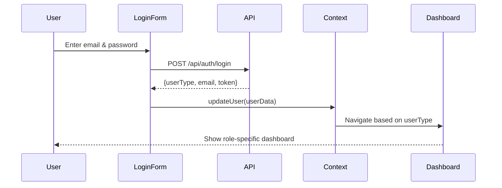

<div align="center">

# 🎨 IPI Smart Academic System - Frontend

### *Modern React SPA with TypeScript, Vite & AI Integration*

[](https://react.dev/)
[](https://www.typescriptlang.org/)
[](https://vitejs.dev/)
[](https://tailwindcss.com/)
[](https://www.framer.com/motion/)
[](#)

**[🚀 Live Demo](https://ipi-smart-academic-system.vercel.app)** • **[📚 Main Docs](../README.md)** • **[🐛 Report Bug](https://github.com/EvillDeadSpace/IPI-Smart-Academic-System/issues)**

</div>

---

## 📋 Table of Contents

- [🎯 Overview](#-overview)
- [✨ Features](#-features)
- [🛠️ Tech Stack](#️-tech-stack)
- [🚀 Getting Started](#-getting-started)
- [📁 Project Structure](#-project-structure)
- [🎨 UI Components](#-ui-components)
- [🔐 Authentication Flow](#-authentication-flow)
- [🎭 State Management](#-state-management)
- [📱 Responsive Design](#-responsive-design)
- [⚡ Performance](#-performance)
- [🚢 Deployment](#-deployment)

---

## 🎯 Overview

The **frontend** is a cutting-edge **React 18** Single Page Application (SPA) built with **TypeScript** and **Vite**, delivering a blazing-fast, type-safe user experience for students, professors, and administrators.

### **🎨 Design Philosophy**

- **🚀 Performance First** - Sub-second load times with code splitting and lazy loading
- **📱 Mobile-First** - Responsive design that scales from smartphones to 4K displays
- **♿ Accessible** - WCAG 2.1 AA compliant with keyboard navigation
- **🎭 Modern UX** - Smooth animations via Framer Motion
- **🔒 Secure** - Protected routes with role-based access control
- **🤖 AI-Enhanced** - Integrated chatbot for instant academic assistance

---

## ✨ Features

### **🔐 Multi-Role Authentication**

```typescript
// Three distinct user roles with dedicated dashboards
type UserRole = 'STUDENT' | 'PROFESOR' | 'ADMIN'
```

<table>
<tr>
<td width="33%">

**👨‍🎓 Student Dashboard**
- 📊 Academic progress
- 📚 Course enrollment
- 📅 Exam registration
- 💬 AI chatbot assistant
- 📈 Grade tracking

</td>
<td width="33%">

**👨‍🏫 Professor Dashboard**
- 📝 Create exams
- ✅ Grade submissions
- 📊 Student analytics
- 📚 Manage subjects
- 📢 Announcements

</td>
<td width="33%">

**🛡️ Admin Panel**
- 👥 User management
- 🎓 Program setup
- 📖 Subject creation
- 📊 System analytics
- ⚙️ Configuration

</td>
</tr>
</table>

### **🎨 UI/UX Highlights**

- **🌈 Dark/Light Mode** - System preference detection with manual toggle
- **✨ Animations** - Framer Motion for page transitions, hover effects
- **📊 Data Visualization** - Interactive charts for academic progress
- **🎭 Skeleton Loaders** - Smooth loading states
- **🔔 Toast Notifications** - Real-time feedback for user actions
- **📱 PWA Support** - Installable as mobile app

### **💬 AI Chatbot Integration**

Real-time conversational AI powered by **Mistral LLM**:

```typescript
// Natural language queries to NLP service
const response = await fetch(`${NLP_URL}/search`, {
  method: 'POST',
  headers: { 'Content-Type': 'application/json' },
  body: JSON.stringify({ word: userQuestion })
})
```

**Features:**
- ⚡ Instant responses (< 2s)
- 🧠 Context-aware answers
- 💡 Faculty knowledge base
- ⌨️ Typing animation effect
- 📝 Conversation history

---

## 🛠️ Tech Stack

### **Core Technologies**

| Technology | Version | Purpose | Why We Chose It |
|------------|---------|---------|-----------------|
|  **React** | 18.3.1 | UI Library | Virtual DOM, hooks, component reusability |
|  **TypeScript** | 5.6.2 | Language | Type safety, IntelliSense, fewer runtime errors |
|  **Vite** | 5.4.10 | Build Tool | Lightning-fast HMR, optimized production builds |

### **Routing & Navigation**

| Package | Version | Purpose |
|---------|---------|---------|
| **React Router** | 7.1.1 | Client-side routing, nested routes |
| **Protected Routes** | Custom | Role-based access control |

### **Styling & UI**

| Package | Version | Purpose |
|---------|---------|---------|
| **TailwindCSS** | 3.4.15 | Utility-first CSS framework |
| **PostCSS** | Latest | CSS processing |
| **Autoprefixer** | Latest | Vendor prefix automation |
| **Radix UI** | Latest | Accessible component primitives |
| **Lucide Icons** | Latest | Modern icon library |

### **Animations & Effects**

| Package | Version | Purpose |
|---------|---------|---------|
| **Framer Motion** | 11.15.0 | Page transitions, micro-interactions |
| **Lottie React** | Latest | Animated illustrations |

### **State Management**

| Approach | Files | Purpose |
|----------|-------|---------|
| **React Context** | `Context.tsx` | Global auth state, user info |
| **Local State** | `useState` | Component-level UI state |
| **Custom Hooks** | `hooks/` | Reusable stateful logic |

### **Development Tools**

| Tool | Purpose |
|------|---------|
| **ESLint** | Code linting (React/TypeScript rules) |
| **Prettier** | Code formatting |
| **VS Code** | Recommended IDE |
| **React DevTools** | Component debugging |

---

## 🚀 Getting Started

### **Prerequisites**

Ensure you have:
- **Node.js** 20+ (`node --version`)
- **npm** 10+ (`npm --version`)
- **Git** for version control

### **Installation**

```bash
# Navigate to frontend directory
cd frontend

# Install dependencies
npm install

# This will install:
# - React 18.3.1
# - TypeScript 5.6.2
# - Vite 5.4.10
# - TailwindCSS 3.4.15
# - React Router 7.1.1
# - Framer Motion 11.15.0
# - And all other dependencies from package.json
```

### **Environment Configuration**

Create `.env` file in `frontend/` directory:

```env
# Backend API endpoint
VITE_BACKEND_URL=http://localhost:3001

# NLP Service endpoint for AI chatbot
VITE_NLP_URL=http://localhost:5000

# Development environment
VITE_NODE_ENV=development
```

**For production**, create `.env.production`:

```env
VITE_BACKEND_URL=https://ipi-smart-academic-system-dzhc.vercel.app
VITE_NLP_URL=https://amartubic.pythonanywhere.com
VITE_NODE_ENV=production
```

### **Running Development Server**

```bash
# Start Vite dev server with HMR
npm run dev

# Output:
# ➜  Local:   http://localhost:5173/
# ➜  Network: http://192.168.1.10:5173/
```

**What happens:**
1. Vite starts development server on port **5173**
2. Hot Module Replacement (HMR) enabled for instant updates
3. TypeScript compilation in watch mode
4. TailwindCSS JIT compiler active
5. Source maps generated for debugging

### **Building for Production**

```bash
# Create optimized production build
npm run build

# Output directory: dist/
# - Minified JavaScript bundles
# - Optimized CSS (purged unused classes)
# - Compressed assets
# - Source maps (optional)

# Preview production build locally
npm run preview
# → http://localhost:4173
```

### **Other Commands**

```bash
# Run ESLint
npm run lint

# Fix ESLint errors automatically
npm run lint:fix

# Type checking without emitting files
npx tsc --noEmit

# Clean install (delete node_modules + reinstall)
rm -rf node_modules package-lock.json
npm install
```

---

## 📁 Project Structure

```
frontend/
│
├── 📂 public/                    # Static assets (served as-is)
│   ├── _redirects               # Netlify redirect rules
│   ├── logo.svg                 # App logo
│   └── robots.txt               # SEO crawler instructions
│
├── 📂 src/                       # Source code
│   │
│   ├── 📂 components/           # React components (feature-based organization)
│   │   │
│   │   ├── 📂 Auth/             # Authentication components
│   │   │   ├── Login.tsx        # Login form (student/professor)
│   │   │   ├── ProtectedRoute.tsx  # Route guard HOC
│   │   │   └── NotFound.tsx     # 404 page
│   │   │
│   │   ├── 📂 Dashboard/        # Role-based dashboard layouts
│   │   │   ├── MainBoard.tsx           # Student dashboard (default)
│   │   │   ├── ProfessorBoard.tsx      # Professor dashboard
│   │   │   ├── AdminBoard.tsx          # Admin panel
│   │   │   ├── DashboardLayout.tsx     # Shared layout wrapper
│   │   │   └── components/             # Dashboard sub-components
│   │   │       ├── Sidebar.tsx
│   │   │       ├── Header.tsx
│   │   │       └── QuickStats.tsx
│   │   │
│   │   ├── 📂 Faculty/          # Academic features
│   │   │   ├── StudentExams.tsx        # Exam registration UI
│   │   │   ├── StudentSchedule.tsx     # Course schedule
│   │   │   ├── StudentProgress.tsx     # Academic progress tracker
│   │   │   ├── CourseEnrollment.tsx    # Subject enrollment
│   │   │   ├── ProfessorExams.tsx      # Exam creation (prof)
│   │   │   ├── GradingInterface.tsx    # Grade submission (prof)
│   │   │   └── SubjectManagement.tsx   # Professor's subjects
│   │   │
│   │   ├── 📂 Common/           # Reusable UI components
│   │   │   ├── Button.tsx       # Custom button component
│   │   │   ├── Input.tsx        # Form input with validation
│   │   │   ├── Card.tsx         # Content card wrapper
│   │   │   ├── Modal.tsx        # Modal dialog
│   │   │   ├── Loader.tsx       # Loading spinner
│   │   │   ├── Toast.tsx        # Notification toast
│   │   │   └── Table.tsx        # Data table
│   │   │
│   │   └── 📂 Chat/             # AI Chatbot
│   │       ├── Chat.tsx         # Main chat interface
│   │       ├── ChatMessage.tsx  # Individual message bubble
│   │       ├── ChatInput.tsx    # Input with send button
│   │       └── TypingIndicator.tsx  # Typing animation
│   │
│   ├── 📂 contexts/             # React Context providers
│   │   ├── Context.tsx          # Global auth & user state
│   │   ├── ThemeContext.tsx     # Dark/light mode toggle
│   │   └── ChatContext.tsx      # Chat conversation state
│   │
│   ├── 📂 hooks/                # Custom React hooks
│   │   ├── useAuth.tsx          # Authentication utilities
│   │   ├── useApi.tsx           # API call wrapper
│   │   ├── useDebounce.tsx      # Debounce input values
│   │   └── useLocalStorage.tsx  # Persistent local storage
│   │
│   ├── 📂 routes/               # Route definitions
│   │   └── AppRoutes.tsx        # Centralized routing config
│   │
│   ├── 📂 types/                # TypeScript type definitions
│   │   ├── user.types.ts        # User, Student, Professor types
│   │   ├── exam.types.ts        # Exam, Registration types
│   │   ├── subject.types.ts     # Subject, Enrollment types
│   │   └── api.types.ts         # API response types
│   │
│   ├── 📂 lib/                  # Utility libraries
│   │   ├── api.ts               # Axios/fetch API client
│   │   ├── utils.ts             # Helper functions
│   │   └── validators.ts        # Form validation schemas
│   │
│   ├── 📂 assets/               # Images, fonts, icons
│   │   ├── images/
│   │   ├── icons/
│   │   └── animations/          # Lottie JSON files
│   │
│   ├── 📄 App.tsx               # Root component with routing
│   ├── 📄 main.tsx              # React entry point (ReactDOM.render)
│   ├── 📄 App.css               # Global styles
│   ├── 📄 index.css             # Tailwind imports
│   └── 📄 vite-env.d.ts         # Vite type definitions
│
├── 📄 index.html                # HTML entry point
├── 📄 package.json              # Dependencies & scripts
├── 📄 tsconfig.json             # TypeScript configuration
├── 📄 vite.config.ts            # Vite build configuration
├── 📄 tailwind.config.js        # TailwindCSS customization
├── 📄 postcss.config.js         # PostCSS plugins
├── 📄 eslint.config.js          # ESLint rules
└── 📄 .env                      # Environment variables (not in Git)
```

---

## 🎨 UI Components

### **Component Architecture**

We follow a **composition-first** approach with reusable primitives:

```typescript
// Example: Composing a student exam card
<Card>
  <Card.Header>
    <Card.Title>Matematika 1</Card.Title>
    <Card.Badge>Dostupno</Card.Badge>
  </Card.Header>
  <Card.Body>
    <Text>Datum: 15.02.2026</Text>
    <Text>Vrijeme: 10:00</Text>
  </Card.Body>
  <Card.Footer>
    <Button variant="primary" onClick={registerForExam}>
      Prijavi se
    </Button>
  </Card.Footer>
</Card>
```

### **Key Component Categories**

#### **1. Layout Components**

- `DashboardLayout` - Sidebar + header + content area
- `ProtectedRoute` - Authentication wrapper
- `Sidebar` - Navigation menu
- `Header` - Top bar with user info

#### **2. Form Components**

- `Input` - Text/email/password fields with validation
- `Select` - Dropdown with search
- `Checkbox` / `Radio` - Form controls
- `DatePicker` - Calendar selector
- `Button` - Primary/secondary/danger variants

#### **3. Data Display**

- `Table` - Sortable, filterable data tables
- `Card` - Content containers
- `Badge` - Status indicators
- `ProgressBar` - Visual progress

#### **4. Feedback Components**

- `Toast` - Success/error notifications
- `Modal` - Confirmation dialogs
- `Loader` - Spinner animations
- `EmptyState` - No data placeholders

---

## 🔐 Authentication Flow

### **Login Process**



### **Implementation**

```typescript
// Context.tsx - Global auth state
export const UserContext = createContext<UserContextType | null>(null)

export const UserProvider: React.FC = ({ children }) => {
  const [userType, setUserType] = useState<UserRole | null>(
    localStorage.getItem('userType') as UserRole
  )
  
  const [email, setEmail] = useState<string | null>(
    localStorage.getItem('userEmail')
  )

  const login = (email: string, type: UserRole) => {
    setEmail(email)
    setUserType(type)
    localStorage.setItem('userEmail', email)
    localStorage.setItem('userType', type)
  }

  const logout = () => {
    setEmail(null)
    setUserType(null)
    localStorage.clear()
  }

  return (
    <UserContext.Provider value={{ email, userType, login, logout }}>
      {children}
    </UserContext.Provider>
  )
}
```

### **Protected Routes**

```typescript
// ProtectedRoute.tsx
const ProtectedRoute: React.FC<{ allowedRoles: UserRole[] }> = ({ 
  children, 
  allowedRoles 
}) => {
  const { userType } = useContext(UserContext)

  if (!userType) {
    return <Navigate to="/login" replace />
  }

  if (!allowedRoles.includes(userType)) {
    return <Navigate to="/unauthorized" replace />
  }

  return <>{children}</>
}

// Usage in App.tsx
<Route 
  path="/professor/dashboard" 
  element={
    <ProtectedRoute allowedRoles={['PROFESOR']}>
      <ProfessorBoard />
    </ProtectedRoute>
  } 
/>
```

---

## 🎭 State Management

### **Global State (React Context)**

We use **React Context API** for:
- ✅ User authentication state
- ✅ User profile information
- ✅ Chat conversation history
- ✅ Theme preference (dark/light)

**Why Context over Redux?**
- Simpler API for small-medium apps
- No boilerplate
- Built-in React feature
- Perfect for auth state

### **Local Component State**

For UI-specific state (form inputs, modals, tabs), we use `useState`:

```typescript
const [isModalOpen, setIsModalOpen] = useState(false)
const [selectedExam, setSelectedExam] = useState<Exam | null>(null)
```

### **Server State**

API data is fetched using custom hooks:

```typescript
// hooks/useApi.tsx
export const useApi = <T,>(url: string) => {
  const [data, setData] = useState<T | null>(null)
  const [loading, setLoading] = useState(true)
  const [error, setError] = useState<string | null>(null)

  useEffect(() => {
    fetch(`${BACKEND_URL}${url}`)
      .then(res => res.json())
      .then(setData)
      .catch(err => setError(err.message))
      .finally(() => setLoading(false))
  }, [url])

  return { data, loading, error }
}

// Usage
const { data: exams, loading } = useApi<Exam[]>('/api/exams/available')
```

---

## 📱 Responsive Design

### **Breakpoint System (TailwindCSS)**

```javascript
// tailwind.config.js
module.exports = {
  theme: {
    screens: {
      'sm': '640px',   // Mobile landscape
      'md': '768px',   // Tablets
      'lg': '1024px',  // Laptops
      'xl': '1280px',  // Desktops
      '2xl': '1536px'  // Large screens
    }
  }
}
```

### **Mobile-First Approach**

```tsx
// Default styles for mobile, then override for larger screens
<div className="
  flex flex-col          /* Mobile: Stack vertically */
  md:flex-row            /* Tablet+: Horizontal layout */
  gap-4                  /* Spacing */
  p-4 md:p-8            /* Smaller padding on mobile */
">
  <Sidebar className="w-full md:w-64" />
  <MainContent className="flex-1" />
</div>
```

### **Responsive Components**

- **Sidebar**: Collapsible on mobile (hamburger menu)
- **Tables**: Horizontal scroll on small screens
- **Cards**: Grid layout adjusts from 1 → 2 → 3 columns
- **Forms**: Full-width on mobile, constrained on desktop

---

## ⚡ Performance Optimization

### **Code Splitting**

```typescript
// Lazy load routes for faster initial load
const ProfessorBoard = lazy(() => import('./components/Dashboard/ProfessorBoard'))
const StudentExams = lazy(() => import('./components/Faculty/StudentExams'))

// Wrap with Suspense
<Suspense fallback={<Loader />}>
  <ProfessorBoard />
</Suspense>
```

### **Asset Optimization**

- **Images**: Lazy loading with `loading="lazy"`
- **SVGs**: Inlined for icons, external for illustrations
- **Fonts**: Preloaded critical fonts
- **Bundle size**: Vite's tree-shaking removes unused code

### **Build Optimizations**

```javascript
// vite.config.ts
export default defineConfig({
  build: {
    rollupOptions: {
      output: {
        manualChunks: {
          vendor: ['react', 'react-dom', 'react-router-dom'],
          ui: ['framer-motion', 'lucide-react']
        }
      }
    },
    minify: 'terser',
    cssCodeSplit: true
  }
})
```

**Production Build Stats:**
- **Bundle size**: ~250 KB (gzipped)
- **First load**: < 1s (on 4G)
- **Lighthouse score**: 95+

---

## 🚢 Deployment

### **Deploying to Vercel**

```bash
# Install Vercel CLI
npm i -g vercel

# Login to Vercel
vercel login

# Deploy to production
vercel --prod

# Set environment variables in Vercel dashboard:
# - VITE_BACKEND_URL
# - VITE_NLP_URL
```

**Vercel configuration** (`vercel.json`):

```json
{
  "buildCommand": "npm run build",
  "outputDirectory": "dist",
  "rewrites": [
    { "source": "/(.*)", "destination": "/" }
  ]
}
```

### **Deploying to Netlify**

```bash
# Install Netlify CLI
npm i -g netlify-cli

# Login
netlify login

# Build
npm run build

# Deploy
netlify deploy --prod --dir=dist

# Configure redirects in public/_redirects:
/*    /index.html   200
```

**Environment variables in Netlify dashboard:**
- `VITE_BACKEND_URL`
- `VITE_NLP_URL`

---

## 🧪 Testing

### **Unit Tests (Coming Soon)**

```bash
# Install testing dependencies
npm install -D vitest @testing-library/react @testing-library/jest-dom

# Run tests
npm run test

# Coverage report
npm run test:coverage
```

---

## 📚 Additional Resources

- **[React Documentation](https://react.dev/)** - Official React guide
- **[TypeScript Handbook](https://www.typescriptlang.org/docs/)** - Learn TypeScript
- **[Vite Guide](https://vitejs.dev/guide/)** - Vite features & config
- **[TailwindCSS Docs](https://tailwindcss.com/docs)** - Utility classes
- **[Framer Motion](https://www.framer.com/motion/)** - Animation library

---

<div align="center">

### 🌟 Built with passion using modern web technologies

**Made with ❤️ for academic excellence**

[⬆ Back to Top](#-ipi-smart-academic-system---frontend)

</div>
